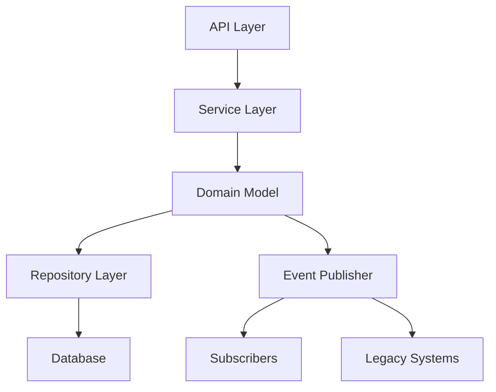

# Gamify API - Comprehensive Gamification Platform

[](https://openjdk.java.net/)
[](https://spring.io/projects/spring-boot)
[](https://www.postgresql.org/)

A robust gamification backend service implementing core game mechanics for user engagement systems. This API enables you to easily integrate gamification elements into your applications, increasing user engagement and motivation through points, achievements, and progression systems.

## 📋 Table of Contents

- [Introduction](#-introduction)
- [Key Features](#-key-features)
- [Getting Started](#-getting-started)
  - [Prerequisites](#prerequisites)
  - [Installation](#installation)
  - [Configuration](#configuration)
  - [Running the API](#running-the-api)
- [API Documentation](#-api-documentation)
  - [Authentication](#authentication)
  - [User Management](#user-management)
  - [Task Events](#task-events)
  - [Achievements](#achievements)
  - [Ladder Status](#ladder-status)
- [Integration Guide](#-integration-guide)
  - [External System Integration](#external-system-integration)
  - [Common Integration Patterns](#common-integration-patterns)
- [Common Workflows](#-common-workflows)
  - [User Registration and Authentication](#user-registration-and-authentication)
  - [Recording Task Completion](#recording-task-completion)
  - [Checking User Progress](#checking-user-progress)
- [Error Handling](#-error-handling)
  - [Common Error Codes](#common-error-codes)
  - [Troubleshooting](#troubleshooting)
- [Testing](#-testing)
  - [Available Test Scripts](#available-test-scripts)
  - [Running Tests](#running-tests)
- [Architecture](#-architecture)
  - [System Design](#system-design)
  - [Data Models](#data-models)
- [Contributing](#-contributing)
- [License](#-license)
- [Contact](#-contact)

## 🚀 Introduction

The Gamify API is designed to help developers easily add gamification elements to their applications. By integrating this API, you can:

- **Motivate Users**: Encourage desired behaviors through points, achievements, and progression systems
- **Track Progress**: Monitor user engagement and activity through comprehensive event tracking
- **Reward Achievement**: Recognize user accomplishments with achievements and level progression
- **Drive Engagement**: Increase user retention and participation with competitive elements

Whether you're building an educational platform, productivity tool, or enterprise application, the Gamify API provides the backend infrastructure needed to implement effective gamification strategies.

## 🎮 Key Features

### Core Game Mechanics
- **User Progression System**
  - Points earning through task completion with priority-based calculations
  - Multi-level ladder system with defined points requirements
  - Achievement system with JSON-based criteria
  - Real-time event processing for progression updates

### Event-Driven Architecture
- Domain events for system reactions
  - `PointsEarnedEvent` with detailed metadata
  - Event processing through `/api/achievements/process/{userId}` endpoint
  - Priority-based points calculation strategy

### Enterprise Features
- REST API endpoints with comprehensive documentation
- JPA/Hibernate persistence
- JSON serialization/deserialization
- Comprehensive validation
- Error handling framework
- JWT-based authentication

## 🛠️ Getting Started

### Prerequisites
- Java 17+
- Maven 3.8+
- PostgreSQL database
- (Optional) IDE with Spring support (IntelliJ IDEA, Eclipse, VS Code)

### Installation
```bash
# Clone the repository
git clone https://github.com/your-org/gamify-api.git
cd gamify-api

# Build the project
mvn clean install
```

### Configuration

The application uses `application.properties` for configuration. Key settings include:

```properties
# Database Configuration
spring.datasource.url=jdbc:postgresql://localhost:5432/gamify_db
spring.datasource.username=postgres
spring.datasource.password=your_password

# JWT Configuration
jwt.secret=your_jwt_secret
jwt.expiration=86400000  # 24 hours in milliseconds

# Server Configuration
server.port=8080
```

Create a database in PostgreSQL:

```sql
CREATE DATABASE gamify_db;
```

### Running the API

```bash
# Run the application
mvn spring-boot:run

# Alternatively, run the JAR file
java -jar target/gamify-demo-0.0.1-SNAPSHOT.jar
```

The API will be available at `http://localhost:8080`.

## 📚 API Documentation

### Authentication

#### User Registration

Registers a new user in the system.

- **URL**: `/auth/register`
- **Method**: `POST`
- **Request Body**:
  ```json
  {
    "username": "john_doe",
    "email": "john@example.com",
    "password": "securePassword123",
    "role": "EMPLOYEE",
    "department": "Engineering"
  }
  ```
- **Success Response** (201 CREATED):
  ```json
  {
    "message": "User registered successfully",
    "userId": "user123"
  }
  ```

#### User Login

Authenticates a user and returns a JWT token.

- **URL**: `/auth/login`
- **Method**: `POST`
- **Request Body**:
  ```json
  {
    "username": "john_doe",
    "password": "securePassword123"
  }
  ```
- **Success Response** (200 OK):
  ```json
  {
    "token": "eyJhbGciOiJIUzI1NiIsInR5cCI6IkpXVCJ9...",
    "user": {
      "id": "user123",
      "username": "john_doe",
      "email": "john@example.com",
      "role": "EMPLOYEE",
      "department": "Engineering",
      "earnedPoints": 150,
      "availablePoints": 150,
      "createdAt": "2023-01-01T12:00:00",
      "updatedAt": "2023-01-15T09:30:00"
    }
  }
  ```

### User Management

#### Get User Profile

Retrieves a user's profile information.

- **URL**: `/api/users/{userId}`
- **Method**: `GET`
- **Headers**: `Authorization: Bearer {jwt_token}`
- **Success Response** (200 OK):
  ```json
  {
    "id": "user123",
    "username": "john_doe",
    "email": "john@example.com",
    "role": "EMPLOYEE",
    "department": "Engineering",
    "earnedPoints": 150,
    "availablePoints": 150,
    "createdAt": "2023-01-01T12:00:00",
    "updatedAt": "2023-01-15T09:30:00"
  }
  ```

#### Create User

Creates a new user (admin only).

- **URL**: `/api/users`
- **Method**: `POST`
- **Headers**: `Authorization: Bearer {jwt_token}`
- **Request Body**:
  ```json
  {
    "username": "new_user",
    "email": "user@example.com",
    "password": "securePassword123",
    "role": "EMPLOYEE",
    "department": "Engineering"
  }
  ```
- **Success Response** (201 CREATED):
  ```json
  {
    "id": "user456",
    "username": "new_user",
    "email": "user@example.com",
    "role": "EMPLOYEE",
    "department": "Engineering",
    "earnedPoints": 0,
    "availablePoints": 0,
    "createdAt": "2023-01-20T14:30:00",
    "updatedAt": "2023-01-20T14:30:00"
  }
  ```

### Task Events

#### Record Task Completion

Records a task completion event and awards points to the user.

- **URL**: `/tasks/events`
- **Method**: `POST`
- **Headers**: `Content-Type: application/json`
- **Request Body**:
  ```json
  {
    "userId": "user123",
    "taskId": "task456",
    "event_type": "TASK_COMPLETED",
    "data": {
      "priority": "HIGH",
      "description": "Complete project documentation"
    }
  }
  ```
- **Success Response** (200 OK):
  ```json
  {
    "success": true,
    "eventId": "evt_123456789",
    "userId": "user123",
    "taskId": "task456",
    "eventType": "TASK_COMPLETED",
    "status": "COMPLETED",
    "pointsAwarded": 30,
    "priority": "HIGH"
  }
  ```

#### Points Calculation

Points are awarded based on the priority of the task:

| Priority  | Points Awarded |
|-----------|---------------|
| LOW       | 10 points     |
| MEDIUM    | 20 points     |
| HIGH      | 30 points     |
| CRITICAL  | 50 points     |
| DEFAULT   | 15 points     |

### Achievements

#### Get All Achievements

Retrieves all available achievements.

- **URL**: `/api/achievements`
- **Method**: `GET`
- **Headers**: `Authorization: Bearer {jwt_token}`
- **Success Response** (200 OK):
  ```json
  [
    {
      "achievementId": "achievement123",
      "name": "Task Master",
      "description": "Complete 10 tasks",
      "criteria": {
        "type": "TASK_COMPLETION_COUNT",
        "count": 10,
        "eventType": "TASK_COMPLETED"
      },
      "createdAt": "2023-01-01T12:00:00"
    },
    {
      "achievementId": "achievement456",
      "name": "Point Collector",
      "description": "Earn 500 points",
      "criteria": {
        "type": "POINTS_THRESHOLD",
        "threshold": 500
      },
      "createdAt": "2023-01-01T12:00:00"
    }
  ]
  ```

#### Get User Achievements

Retrieves achievements earned by a specific user.

- **URL**: `/api/achievements/user/{userId}`
- **Method**: `GET`
- **Headers**: `Authorization: Bearer {jwt_token}`
- **Success Response** (200 OK):
  ```json
  {
    "userId": "user123",
    "username": "john_doe",
    "achievements": [
      {
        "id": "achievement123",
        "name": "Task Master",
        "description": "Complete 10 tasks",
        "earnedAt": "2023-01-15T09:30:00",
        "metadata": {
          "eventType": "TASK_COMPLETED",
          "eventData": {
            "taskId": "task789",
            "taskName": "Complete Project"
          }
        },
        "earned": true
      }
    ],
    "totalAchievements": 10,
    "earnedAchievements": 1
  }
  ```

#### Process Achievement Event

Processes an event for a user to check for achievement unlocks.

- **URL**: `/api/achievements/process/{userId}`
- **Method**: `POST`
- **Headers**: `Content-Type: application/json`
- **Request Body**:
  ```json
  {
    "eventType": "TASK_COMPLETED",
    "eventDetails": {
      "taskId": "task-789",
      "priority": "HIGH"
    }
  }
  ```
- **Success Response** (200 OK):
  ```json
  {
    "processed": true,
    "achievementsUnlocked": [
      {
        "id": "achievement123",
        "name": "Task Master",
        "description": "Complete 10 tasks",
        "earnedAt": "2023-01-20T15:45:00"
      }
    ]
  }
  ```

### Ladder Status

#### Get User Ladder Status

Retrieves a user's current ladder status.

- **URL**: `/api/ladder/status?userId={userId}`
- **Method**: `GET`
- **Headers**: `Authorization: Bearer {jwt_token}`
- **Success Response** (200 OK):
  ```json
  {
    "currentLevel": 2,
    "levelLabel": "Intermediate",
    "earnedPoints": 250,
    "pointsToNextLevel": 150
  }
  ```

## 🔄 Integration Guide

### External System Integration

The Gamify API is designed to be easily integrated with external systems. Here's how to integrate with your existing applications:

#### 1. User Synchronization

When a new user is created in your system, register them with the Gamify API:

```bash
curl -X POST http://your-gamify-api-url/auth/register \
  -H "Content-Type: application/json" \
  -d '{
    "username": "user_from_external_system",
    "email": "user@example.com",
    "password": "generated_password",
    "role": "EMPLOYEE",
    "department": "Sales"
  }'
```

#### 2. Task Completion Events

When a user completes a task in your system, send a task completion event:

```bash
curl -X POST http://your-gamify-api-url/tasks/events \
  -H "Content-Type: application/json" \
  -d '{
    "userId": "user123",
    "taskId": "task456",
    "event_type": "TASK_COMPLETED",
    "data": {
      "priority": "HIGH",
      "description": "Complete sales report"
    }
  }'
```

#### 3. Display User Progress

Retrieve and display a user's achievements and ladder status:

```bash
# Get user achievements
curl -X GET http://your-gamify-api-url/api/achievements/user/user123 \
  -H "Authorization: Bearer your_jwt_token"

# Get user ladder status
curl -X GET http://your-gamify-api-url/api/ladder/status?userId=user123 \
  -H "Authorization: Bearer your_jwt_token"
```

### Common Integration Patterns

#### Webhook Integration

1. Configure your system to send webhooks to the Gamify API when relevant events occur
2. Map your system's events to the appropriate Gamify API endpoints
3. Process the responses to update your UI or trigger additional actions

#### Scheduled Synchronization

1. Set up a scheduled job to synchronize user data between your system and the Gamify API
2. Batch process task completions and other events
3. Update your system with the latest gamification data

#### Real-time Integration

1. Integrate the Gamify API directly into your application's workflow
2. Send events in real-time as users complete actions
3. Display immediate feedback based on the API responses

## 🔄 Common Workflows

### User Registration and Authentication

1. Register a new user:
   ```bash
   curl -X POST http://localhost:8080/auth/register \
     -H "Content-Type: application/json" \
     -d '{
       "username": "john_doe",
       "email": "john@example.com",
       "password": "securePassword123",
       "role": "EMPLOYEE",
       "department": "Engineering"
     }'
   ```

2. Login to get a JWT token:
   ```bash
   curl -X POST http://localhost:8080/auth/login \
     -H "Content-Type: application/json" \
     -d '{
       "username": "john_doe",
       "password": "securePassword123"
     }'
   ```

3. Use the JWT token for authenticated requests:
   ```bash
   curl -X GET http://localhost:8080/api/users/user123 \
     -H "Authorization: Bearer your_jwt_token"
   ```

### Recording Task Completion

1. Send a task completion event:
   ```bash
   curl -X POST http://localhost:8080/tasks/events \
     -H "Content-Type: application/json" \
     -d '{
       "userId": "user123",
       "taskId": "task456",
       "event_type": "TASK_COMPLETED",
       "data": {
         "priority": "HIGH",
         "description": "Complete project documentation"
       }
     }'
   ```

2. The system will:
   - Log the task event
   - Calculate points based on task priority
   - Update the user's earned points and available points
   - Record the transaction in the points_transactions table
   - Update the user's ladder status if they cross a threshold

### Checking User Progress

1. Check a user's achievements:
   ```bash
   curl -X GET http://localhost:8080/api/achievements/user/user123 \
     -H "Authorization: Bearer your_jwt_token"
   ```

2. Check a user's ladder status:
   ```bash
   curl -X GET http://localhost:8080/api/ladder/status?userId=user123 \
     -H "Authorization: Bearer your_jwt_token"
   ```

## ❗ Error Handling

### Common Error Codes

| Status Code | Description           | Common Causes                                      |
|-------------|-----------------------|---------------------------------------------------|
| 400         | Bad Request           | Invalid input, missing required fields             |
| 401         | Unauthorized          | Invalid or expired JWT token                       |
| 403         | Forbidden             | Insufficient permissions for the requested action  |
| 404         | Not Found             | Resource (user, achievement, etc.) does not exist  |
| 409         | Conflict              | Username or email already exists                   |
| 500         | Internal Server Error | Server-side error                                  |

### Troubleshooting

#### Authentication Issues

- Ensure you're using the correct username and password
- Check that your JWT token is valid and not expired
- Verify that you're including the token in the Authorization header with the "Bearer" prefix

#### Task Event Processing

- Verify that the user ID exists in the system
- Ensure the event_type is "TASK_COMPLETED"
- Check that the data object includes valid priority values

#### Achievement Processing

- Verify that the achievement criteria are correctly defined
- Ensure the user has performed the actions required to unlock the achievement
- Check that the event types match the expected values for the achievement criteria

## 🧪 Testing

### Available Test Scripts

The project includes several test scripts to help you verify the functionality:

- **User Tests**: `./src/test/run-user-tests.sh`
- **Task Completion Tests**: `./src/test/run-task-completion-tests.sh`
- **Ladder Status Tests**: `./src/test/run-ladder-tests.sh`
- **Achievement Tests**: `./src/test/run-achievement-tests.sh`

### Running Tests

```bash
# Run all tests
mvn test

# Run a specific test class
mvn test -Dtest=UserRepositoryTest

# Run integration tests
mvn test -Dtest=*IntegrationTest

# Run test scripts
cd src/test
./run-tests-in-batches.sh
```

## 🏗️ Architecture

### System Design

The Gamify API is built using a layered architecture with the following components:



### Design Patterns Used

1. **Strategy Pattern**: Used for calculating points and evaluating achievement criteria
2. **Factory Pattern**: Used for creating objects like Achievements and UserAchievements
3. **Observer Pattern**: Used for event processing
4. **Facade Pattern**: Used to simplify interactions between controllers and services
5. **DTO Pattern**: Used for transferring data between layers

### Data Models

#### Core Entities

##### Achievement
```java
@Entity
@Table(name = "achievements")
public class Achievement {
    @Id
    private String achievementId; // UUID
    private String name;
    private String description;
    @Type(JsonType.class)
    private JsonNode criteria; // JSON criteria
    private LocalDateTime createdAt;
}
```

##### LadderLevel
```java
@Entity
@Table(name = "ladder_levels")
public class LadderLevel {
    @Id
    private int level;
    private String label;
    private int pointsRequired;
    private LocalDateTime createdAt;
}
```

##### User
```java
@Entity
@Table(name = "users")
public class User {
    @Id
    private String id; // UUID
    private String username;
    private String email;
    private String password;
    private String role;
    private String department;
    private int earnedPoints;
    private int availablePoints;
    private LocalDateTime createdAt;
    private LocalDateTime updatedAt;
}
```

## 🤝 Contributing

We welcome contributions to the Gamify API! Here's how to get started:

1. Fork the repository
2. Create a feature branch (`git checkout -b feature/amazing-feature`)
3. Commit your changes (`git commit -m 'Add amazing feature'`)
4. Push to the branch (`git push origin feature/amazing-feature`)
5. Open a Pull Request

Please make sure your code follows our coding standards and includes appropriate tests.

## 📄 License

Distributed under the MIT License. See `LICENSE` for more information.

## 📬 Contact

Project Maintainer - [Your Name](mailto:your.email@example.com)  
Project Link - [https://github.com/your-org/gamify-api](https://github.com/your-org/gamify-api)
