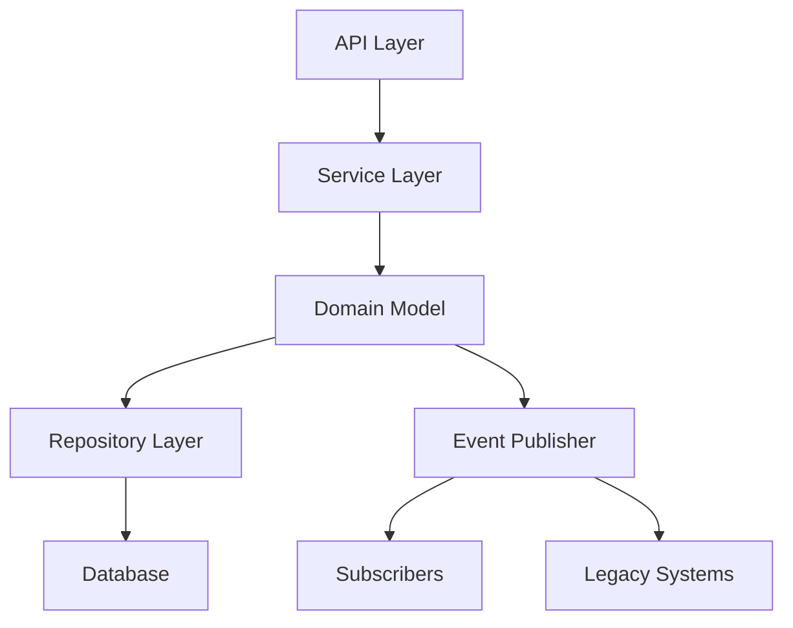

# gamify-api# Gamify Demo - Gamification Platform Backend

[](https://openjdk.java.net/)
[](https://spring.io/projects/spring-boot)

A robust gamification backend service implementing core game mechanics for user engagement systems.

## 🎮 Key Features

### Core Game Mechanics
- **User Progression System**
  - Points earning/spending transactions
  - Multi-level ladder system
  - Achievement unlocking
  - Real-time leaderboard updates

### Event-Driven Architecture
- Domain events for system reactions
  - `TaskCompletedEvent`
  - `PointsEarnedEvent`
  - `PointsSpentEvent`
- Dual publication system (modern + legacy)

### Enterprise Features
- REST API endpoints
- JPA/Hibernate persistence
- JSON serialization/deserialization
- Comprehensive validation
- Error handling framework

## 🛠️ Tech Stack

| Component               | Technology                          |
|-------------------------|-------------------------------------|
| **Backend Framework**   | Spring Boot 3.1                     |
| **Database**            | H2 (Embedded/File-based)            |
| **Testing**             | JUnit 5, Mockito                    |
| **Build Tool**          | Maven                               |
| **Code Quality**        | Lombok, Validation API              |
| **API Documentation**   | OpenAPI (SpringDoc)                 |

## 🚀 Getting Started

### Prerequisites
- Java 17+
- Maven 3.8+
- (Optional) IDE with Spring support

### Installation
```bash
git clone https://github.com/your-org/gamify-demo.git
cd gamify-demo
mvn clean install
```

### Running
```bash
mvn spring-boot:run
```

## 📚 API Documentation

### User Management
```http
POST /api/users
Content-Type: application/json

{
  "username": "new_user",
  "email": "user@example.com",
  "department": "Engineering"
}
```

### Ladder Progression
```http
PUT /api/ladder/users/{userId}
```

### Event Endpoints
```http
POST /api/events
Content-Type: application/json

{
  "eventType": "TASK_COMPLETED",
  "userId": "user123",
  "data": {
    "taskId": "task-789",
    "pointsAwarded": 50
  }
}
```

## 🧪 Testing Strategy

### Test Pyramid Implementation
```bash
mvn test
```

### Key Test Components
- **Domain Event Tests**  
  (See [`DomainEventPublisherTest.java`](src/test/java/sg/edu/ntu/gamify_demo/events/domain/DomainEventPublisherTest.java))
  - Event type validation
  - Data integrity checks
  - Legacy system compatibility
  - Metadata persistence

### Test Coverage
| Aspect                | Coverage Mechanism                  |
|-----------------------|--------------------------------------|
| Business Logic        | Unit tests with Mockito              |
| API Contracts         | Integration tests                    |
| Data Serialization    | JSON assertion validations           |
| Error Conditions      | Exception handler tests              |

## 🏗️ System Architecture



## 📦 Data Model Highlights

### Core Entities
```java
@Entity
public class User {
    private String id;
    private String username;
    private int earnedPoints;
    private int availablePoints;
    // ... other fields
}

@Entity
public class TaskEvent {
    private String taskId;
    private String eventId;
    private int pointsAwarded;
    // ... other fields
}
```

## 🤝 Contributing

1. Fork the repository
2. Create feature branch (`git checkout -b feature/amazing-feature`)
3. Commit changes (`git commit -m 'Add amazing feature'`)
4. Push branch (`git push origin feature/amazing-feature`)
5. Open Pull Request

## 📄 License
Distributed under the MIT License. See `LICENSE` for more information.

---

**📬 Contact**  
Project Maintainer - [Your Name](mailto:your.email@example.com)  
Project Link - [https://github.com/your-org/gamify-demo](https://github.com/your-org/gamify-demo)
