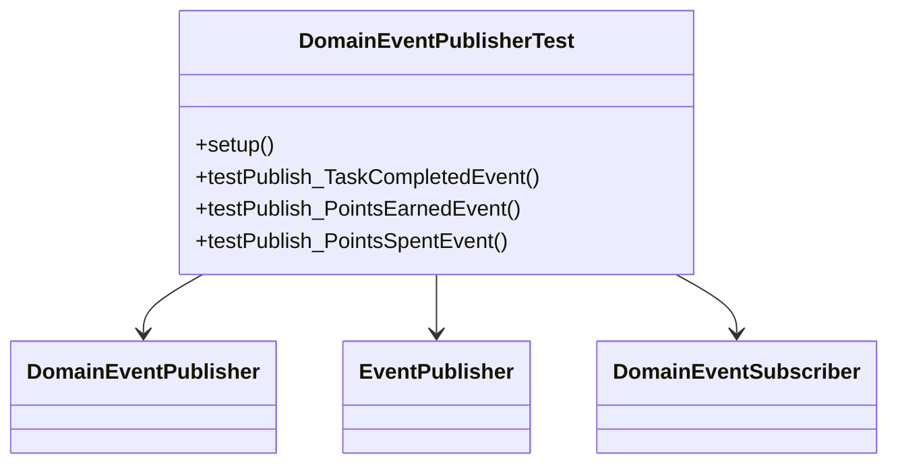

# DomainEventPublisher Test Documentation

## Test Overview
| Aspect                | Details                                 |
|-----------------------|-----------------------------------------|
| Package               | `sg.edu.ntu.gamify_demo.events.domain`  |
| Test Type             | Unit (Behavioral)                       |
| Mocked Components     | EventPublisher, DomainEventSubscriber   |
| Key Dependencies      | ObjectMapper, User model                |

## Test Architecture


## Test Cases
| Method                          | Scenario                                                                 | Verification Points                                                                 |
|---------------------------------|-------------------------------------------------------------------------|-------------------------------------------------------------------------------------|
| `testPublish_TaskCompletedEvent` | Task completion with metadata                                           | 1. Subscriber notification<br>2. Legacy format conversion<br>3. Metadata persistence |
| `testPublish_PointsEarnedEvent`  | Points earning transaction                                              | 1. Points calculation<br>2. Source tracking<br>3. Balance update                    |
| `testPublish_PointsSpentEvent`   | Points deduction validation                                             | 1. Balance deduction<br>2. Spend source tracking<br>3. Metadata integrity          |

## Verification Matrix
| Assertion Type        | Count | Examples                              |
|-----------------------|-------|---------------------------------------|
| Behavioral            | 6     | `verify(testSubscriber, times(1))`    |
| Data Integrity        | 12    | `assertEquals("task123", ...)`        |
| State Change          | 3     | Points balance assertions             |

## Configuration
```java
@BeforeEach
public void setup() {
    legacyEventPublisher = mock(EventPublisher.class);
    objectMapper = new ObjectMapper();
    testSubscriber = mock(DomainEventSubscriber.class);
    testUser = new User(); // 100 points initialized
    publisher.register(testSubscriber);
}
```

## Edge Case Coverage
- Complex JSON metadata handling
- Points balance edge transitions (100 → 150 → 70)
- Legacy system compatibility checks
```
