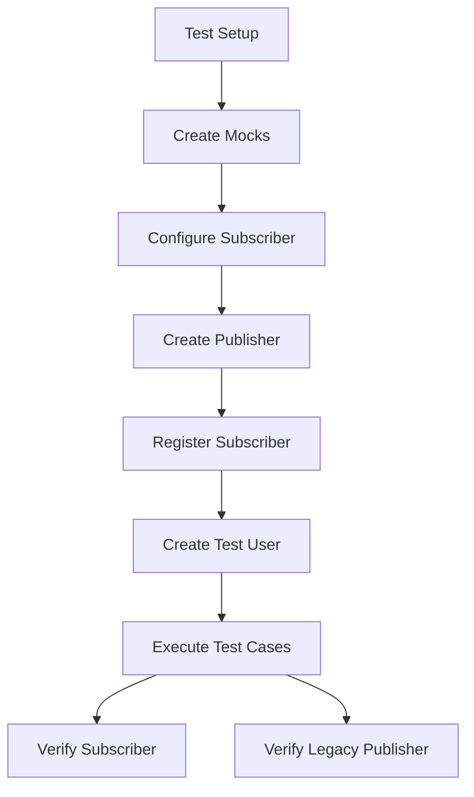

# Domain Event Publisher Test Documentation

## 📋 Test Overview
| Aspect               | Description                                                                 |
|----------------------|-----------------------------------------------------------------------------|
| **Test Class**       | `sg.edu.ntu.gamify_demo.events.domain.DomainEventPublisherTest`             |
| **Test Type**        | Unit Tests                                                                  |
| **Test Framework**   | JUnit 5                                                                    |
| **Mocking Library**  | Mockito                                                                    |
| **Key Components**   | `DomainEventPublisher`, Legacy `EventPublisher`, `DomainEventSubscriber`   |

## 🧪 Key Test Cases

### 1. `testPublish_TaskCompletedEvent()`
**Scenario**: Verifies task completion event handling  
**Verifications**:
- Subscriber receives TaskCompletedEvent with correct metadata
- Legacy publisher receives:
  ```json
  {
    "taskId": "task123",
    "eventId": "event123",
    "pointsAwarded": 30,
    "metadata": {"priority": "HIGH"}
  }
  ```

### 2. `testPublish_PointsEarnedEvent()`
**Scenario**: Validates points earning propagation  
**Verifications**:
- Points update integrity (50 points added, new total 150)
- Legacy system receives:
  ```json
  {
    "points": 50,
    "newTotal": 150,
    "source": "TEST_SOURCE",
    "metadata": {"source": "test"}
  }
  ```

### 3. `testPublish_PointsSpentEvent()` 
**Scenario**: Tests points deduction handling  
**Verifications**:
- Correct balance update (30 spent from 100)
- Legacy format contains:
  ```json
  {
    "points": 30,
    "newTotal": 70,
    "source": "TEST_SPEND",
    "metadata": {"source": "test"}
  }
  ```

## ⚙️ Test Setup
```java
@BeforeEach
public void setup() {
    // 1. Create mock legacy publisher
    // 2. Configure object mapper
    // 3. Prepare test user with 100 points
    // 4. Register test subscriber
}
```

## 🔍 Coverage Analysis
| Coverage Aspect      | Details                                                                 |
|----------------------|-------------------------------------------------------------------------|
| **Event Types**      | Task Completed, Points Earned, Points Spent                           |
| **Data Integrity**   | Verifies all event metadata and numerical values                       |
| **System Integration** | Dual verification: Subscriber + Legacy publisher                      |
| **Edge Cases**       | Metadata handling, point balance calculations                         |

## 🛠️ Custom Assertions
```java
private void assertEquals(Object expected, Object actual) {
    // Custom equality check with explicit failure reporting
}
```

## ▶️ Test Execution Guide
1. Run all tests: `mvn test`
2. Run specific test: `mvn -Dtest=DomainEventPublisherTest test`
3. Generate coverage report: `mvn jacoco:report`

## 📊 Test Flow Diagram


## ✅ Best Practices
- Keep test data consistent across test cases
- Use descriptive test names
- Verify both new and legacy systems
- Include metadata verification
- Maintain clear separation of test phases
